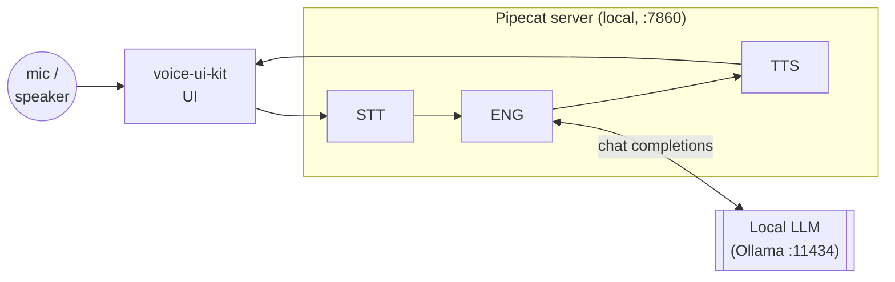
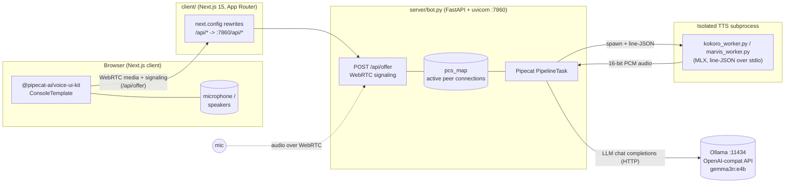
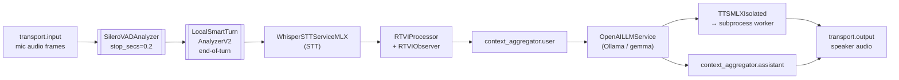
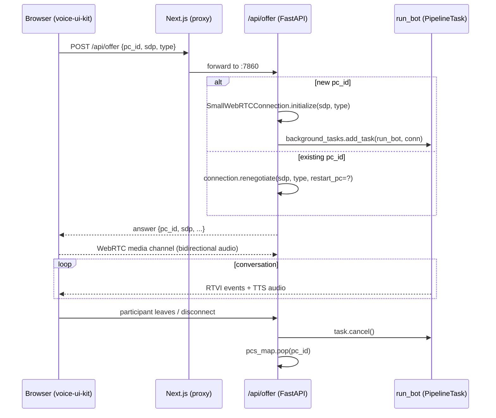
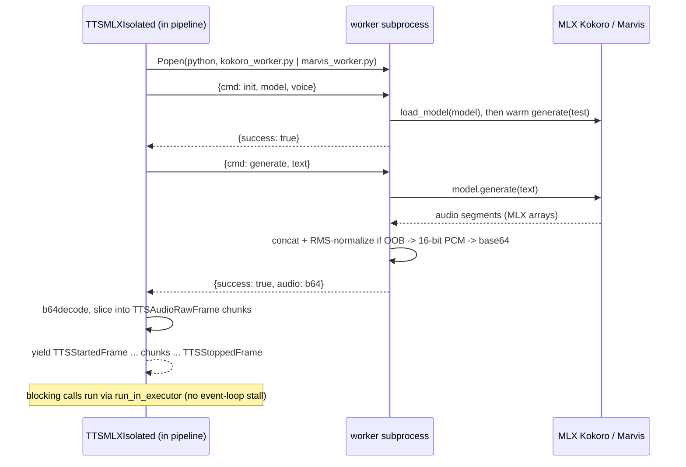
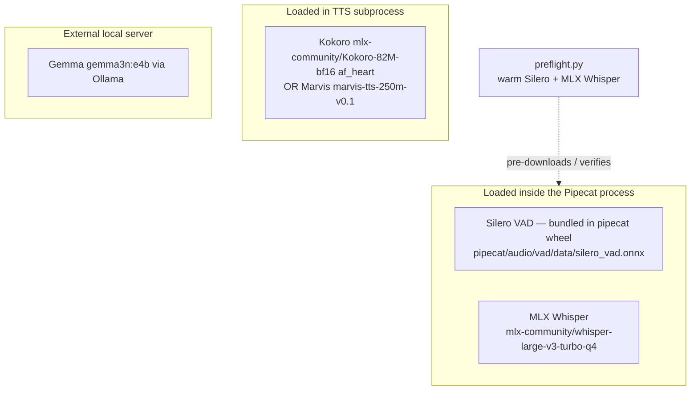
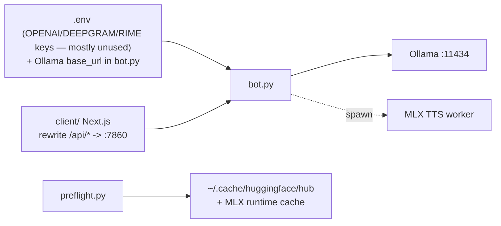

# Architecture — macOS Local Voice Agents

A fully **on-device** (Mac) voice agent: a browser talks **WebRTC** to a Python
**Pipecat** server that runs STT and TTS locally on Apple Silicon (MLX) and
streams conversation turns to a local **Ollama** LLM. No cloud inference — every
model (Whisper STT, Kokoro/Marvis TTS, Gemma LLM, Smart-Turn) runs on the host
machine.

## High-level view

Four layers, one audio/text loop between the client and the local server, and
the LLM pulled out as an *external local* service. This is the big picture —
every hop is expanded in the sections that follow.



## Component & data flow (detailed)



---

## 1. Components at a glance

| Layer | Location | Tech | Responsibility |
| --- | --- | --- | --- |
| **Client UI** | `client/` | Next.js 15 App Router, React 19, `@pipecat-ai/voice-ui-kit` | Renders the voice console, captures mic audio, plays TTS audio, shows transcripts / events. |
| **API proxy** | `client/next.config.ts` | Next.js `rewrites` | Forwards `/api/*` to the Python server at `http://0.0.0.0:7860/api/*`. The browser only ever knows the Next origin. |
| **Signaling** | `server/bot.py` (`/api/offer`) | FastAPI + uvicorn | WebRTC `offer`/`answer` exchange; tracks live peer connections; negotiates restart/renegotiation. |
| **Conversation engine** | `server/bot.py` (`run_bot`) | Pipecat `Pipeline` / `PipelineTask` | Orchestrates VAD → STT → LLM → TTS and emits RTVI events back to the client. |
| **STT** | in-process | `WhisperSTTServiceMLX` (Whisper large-v3 turbo q4, MLX) | Speech-to-text, non-streaming (delivers full transcript per turn). |
| **LLM** | external | Ollama `gemma3n:e4b` via OpenAI-compatible API | Generates the reply. `api_key="dummyKey"` — Ollama ignores it. |
| **TTS** | **subprocess** | `kokoro_worker.py` / `marvis_worker.py` (MLX Kokoro / Marvis) | Text-to-speech, isolated to dodge Apple-Silicon Metal threading issues. |
| **VAD / turn** | in-process | `SileroVADAnalyzer` + `LocalSmartTurnAnalyzerV2` | Voice-activity detection and local end-of-turn detection. |
| **Model preflight** | `server/preflight.py` | standalone script | Pre-downloads & verifies Silero VAD + MLX Whisper so the first `bot.py` run is fast. |

---

## 2. The Pipecat pipeline (the heart of the server)

Each WebRTC call gets its own `PipelineTask`. Frames flow left→right; the
`context_aggregator` splits into `.user()` and `.assistant()` endpoints so
conversation history is preserved symmetrically.



**Key design choices**

- **STT is non-streaming.** Whisper (MLX) emits the *whole* transcript after
  `UserStoppedSpeaking`. Hence `LLMUserAggregatorParams(aggregation_timeout=0.05)`
   — a near-zero delay — because there's no incremental user text to coalesce.
- **RTVI** (`RTVIProcessor` + `RTVIObserver`) is the bridge to the web UI: it
  turns internal Pipecat frames into events the `voice-ui-kit` client renders
   (transcriptions, TTS start/stop, etc.).
- **Kicking off the dialogue.** On `rtvi.on_client_ready`, the task queues a
   `context_frame` so the LLM opens with the system prompt / greeting
   ("Hello, I'm Pipecat!").
- **Lifecycle events.**
   - `on_first_participant_joined` → start capturing that participant's
    transcription.
   - `on_participant_left` → `task.cancel()` (end the conversation).
   - `on_connection.closed` → drop the peer connection from `pcs_map`.

---

## 3. WebRTC signaling & connection lifecycle



- **`pcs_map`** (`Dict[str, SmallWebRTCConnection]`) is the registry of live
  calls, keyed by `pc_id`.
- **Renegotiation vs. new connection.** If the `pc_id` is already tracked, the
  offer is applied as a renegotiation (optionally restarting the peer
  connection); otherwise a fresh `SmallWebRTCConnection` is created and `run_bot`
  is scheduled as a FastAPI **background task**.
- **ICE.** A single public STUN server is configured for candidate gathering
   (loopback-only operation, but left in so remote peers would work).
- **Clean shutdown.** The FastAPI `lifespan` disconnects every connection in
   `pcs_map` on process exit.

---

## 4. Isolated TTS (avoiding Metal threading conflicts)

Apple Silicon's Metal runtime doesn't play well with MLX being driven from
multiple threads/contexts. TTS is therefore run in a **dedicated subprocess**
that speaks a tiny **line-delimited JSON protocol** over stdio.



**Protocol & behavior**

- **Worker selection.** `TTSMLXIsolated._get_worker_script_path()` picks
   `marvis_worker.py` if the model name starts with `Marvis-AI`, otherwise
   `kokoro_worker.py`. Both live next to `tts_mlx_isolated.py`.
- **Lazy init.** The subprocess is spawned on first use; `init` loads the model
  and does a one-shot warm-up `generate("test")`.
- **Synchronous stdio, async wrapper.** `_send_command()` blocks on a 10 s
   `select.select` read; it's invoked through `loop.run_in_executor` so the
  pipeline's async event loop is never stalled.
- **Audio pipeline in the worker.** `generate` collects all MLX segments,
  concatenates them, **RMS-normalizes** only if samples exceed `[-1, 1]`
   (peak-limited scaling, target RMS 0.1), rejects silent output, then converts to
   **16-bit PCM → base64**.
- **Back to the pipeline.** The service base64-decodes the PCM and re-chunks it
  into `TTSAudioRawFrame`s (one per chunk, 1 ms jitter) wrapped in
   `TTSStartedFrame` / `TTSStoppedFrame`, emitting `ErrorFrame` on failure.

> **Maintenance note:** `kokoro_worker.py` and `marvis_worker.py` are near-identical
> copies of the same worker (differ mainly in default model/voice and Marvis's
> added RMS-normalization block). They are strong candidates for a single shared
> worker with a `--model`/`--voice` argument.

---

## 5. Local model inventory & pre-warming



- **Two models are loaded *before* the first turn** (Silero VAD in-process,
  MLX Whisper for STT), slowing first startup to ~30 s+.
- **`preflight.py`** removes that first-run cost:
   - *Silero VAD* ships inside the `pipecat` wheel and is **not** an HF download —
    the script only verifies the `.onnx` resource is present and loadable by
    ONNXRuntime.
   - *MLX Whisper* runs `snapshot_download(mlx-community/whisper-large-v3-turbo-q4)`
    then a real `mlx_whisper.transcribe` on a 3 s silent buffer — exactly the
    path `bot.py` uses — to warm the model into MLX memory.
   - Flags: `--whisper <repo>` (any MLX tag), `--offline` (`HF_HUB_OFFLINE=1`,
    verify only), `--skip-silero`.
- **TTS pre-warm** is a separate manual step: one `mlx_audio.tts.generate ...
--play` before the first run so the Kokoro/Marvis weights are cached.
- **Ollama** model must be pulled once: `ollama pull gemma3n:e4b`
   (`ollama serve` on `:11434`).

---

## 6. Data & config flow



- **LLM endpoint** is hard-coded in `bot.py` (`http://127.0.0.1:11434/v1`,
  model `gemma3n:e4b`); swap the tag to whatever `ollama list` shows.
- **`.env`** (`server/env.example`) defines `OPENAI_API_KEY`,
   `DEEPGRAM_API_KEY`, `RIME_API_KEY` — inherited from the upstream Pipecat
  template but largely irrelevant here, since only Ollama (dummy key) is used in
   `bot.py`.
- **Model cache:** HF models land in `~/.cache/huggingface/hub`
   (`HUGGINGFACE_HUB_CACHE` overridable); Ollama models in Ollama's own store.
- **Ports:** Python server `:7860` (`bot.py --port`, default `localhost`);
  Ollama `:11434`; Next.js dev server on its own port and rewrites API to 7860.

---

## 7. Run order (cheat sheet)

```shell
# 1. LLM
ollama pull gemma3n:e4b && ollama serve         # :11434

# 2. (optional) pre-warm STT/VAD + TTS in server/
uv run python preflight.py
mlx_audio.tts.generate --model "mlx-community/Kokoro-82M-bf16" --text "..." --play

# 3. server
cd server && uv run bot.py                      # :7860

# 4. client
cd client && npm run dev
```

---

## 8. Notable source files

| File | What it is |
| --- | --- |
| `server/bot.py` | FastAPI signaling + Pipecat `PipelineTask` orchestration; `pcs_map`, RTVI handlers, system prompt. |
| `server/tts_mlx_isolated.py` | `TTSMLXIsolated` `TTSService` that wraps the subprocess worker (JSON-over-stdio, 16-bit PCM). |
| `server/kokoro_worker.py` | Isolated Kokoro MLX TTS worker (default path). |
| `server/marvis_worker.py` | Isolated Marvis MLX TTS worker (+ RMS normalization); near-identical to Kokoro's. |
| `server/preflight.py` | Pre-download & verify Silero VAD + MLX Whisper. |
| `server/pyproject.toml` / `uv.lock` | Pinned Apple-Silicon dependencies (`mlx*`, `av`, `opencv`, `pyobjc*`, `pipecat-ai[...]`). |
| `client/src/app/page.tsx` | Voice console page (`ConsoleTemplate`, `smallwebrtc`, `connectionUrl="/api/offer"`). |
| `client/next.config.ts` | `/api/*` → `:7860` rewrite. |

---

## Appendix A. Glossary of terms, protocols & names

A reference for every abbreviation, protocol, framework, and name used
above. Grouped by kind; within a group, alphabetical.

### A.1 Protocols & transports

| Term | Meaning |
| --- | --- |
| `WebRTC` | Web Real-Time Communication — a browser/standard protocol for low-latency, peer-to-peer bidirectional media (audio/video/data) over the internet. Carries the mic and TTS audio. |
| `RTCPeerConnection` / `PC` | The WebRTC object that establishes and manages a media session between two peers. `pcs_map` keys connections by `pc_id` (a per-connection id). |
| `SDP` / `offer` / `answer` | Session Description Protocol. Peers describe their media with an SDP blob; the first one (`offer`) is exchanged, and each replies with `answer` — the WebRTC signalling dance behind `POST /api/offer`. |
| `ICE` | Interactive Connectivity Establishment — finds the best network path (host/srflx/relay candidates) between two peers. |
| `STUN` | Server Traversal Utilities for NAT — a lookup server that tells a peer its public address; needed for ICE candidate gathering (this repo uses `stun:stun.l.google.com:19302`). |
| `TURN` | Traversal Using relays for NAT — a fallback media relay for symmetric NATs that ICE alone can't cross. Not configured here (loopback-only). |
| `RTVI` | **R**eal-**T**ime **V**oice **I**nterface — Pipecat/Daily's client-facing event protocol that streams connection + service events (transcripts, TTS start/stop, metrics) from the server pipeline to the web UI. Exposed as `RTVIEvent` on the client and `RTVIProcessor`/`RTVIObserver` inside the pipeline. |
| `HTTP` / `REST` | The plain HTTP used for signaling (`/api/offer`) and for LLM calls. |
| `OpenAI-compatible API` / `chat completions` | An HTTP endpoint shaped like OpenAI's `/v1/chat/completions`. Ollama speaks it, so `OpenAILLMService` talks to Ollama as if it were OpenAI. |
| `JSON-line protocol` | The TTS worker I/O format: one JSON object per line over stdin/stdout (`{"cmd": …}` → `{"success": …}`). Deliberately trivial so a plain `subprocess` can speak it. |
| `stdio` | Standard input/output file descriptors — the channel the parent `TTSMLXIsolated` service uses to talk to its child worker process. |

### A.2 AI, audio & signal-processing terms

| Term | Meaning |
| --- | --- |
| `LLM` | Large Language Model — the reasoning model that turns the transcript into a reply. |
| `STT` | Speech-To-Text — turns mic audio into a transcript. Done by MLX Whisper, **non-streaming** (full transcript delivered after the user stops speaking). |
| `TTS` | Text-To-Speech — turns the LLM reply into audio. Done by an isolated Kokoro/Marvis worker. |
| `VAD` | Voice Activity Detection — classifies audio as speech vs. silence so the system knows when the user is and isn't talking. Implemented by `SileroVADAnalyzer`. |
| `ASR` | Automatic Speech Recognition — the field `STT` belongs to. |
| `G2P` | Grapheme-To-Phoneme — converting written text to phoneme sequences; part of Kokoro's front-end. |
| `PCM` | Pulse-Code Modulation — raw, uncompressed audio samples. The worker outputs **16-bit PCM** (signed `int16`), which the pipeline re-chunks into frames. |
| `RMS` / RMS normalization | Root-Mean-Square loudness. The worker scales output toward a target RMS (`0.1`), peak-limited to `[-1, 1]`, only if samples ever exceed that range (prevents clipping). |
| `TTFB` | Time-To-First-Byte — latency metric the TTS service tracks (how long until the first audio chunk is ready). |
| `RTF` | Real-Time Factor — compute time ÷ audio duration; `< 1` means faster than real time. |
| `PLE` | Per-Layer Embeddings — a Gemma 3n memory trick that keeps many embedding parameters out of accelerator memory by caching them to fast storage. |
| `MatFormer` / Matryoshka | Gemma 3n's nested-transformer architecture: a larger model contains functional sub-models, enabling `E4B` (effective 4B) operation. |
| `MoE` | Mixture-of-Experts — a model architecture with specialist "experts" selectively activated per token. |
| `q4` / `q8` / `bf16` / `fp16` | Quantization / numeric-precision tags: `q4`/`q8` = 4-/8-bit integer weights; `bf16`/`fp16` = 16-bit floating point. E.g. `LARGE_V3_TURBO_Q4` is 4-bit. |
| `non-autoregressive` | TTS that generates a whole utterance in forward passes (no token-by-token sampling loop) — how Kokoro works, so it streams cleanly. |
| `pre-warm` / `preflight` / `cache` | Loading & verifying model weights *before* first use so the first conversation doesn't pay a download cost. `preflight.py` does this for Silero + MLX Whisper; Ollama pulls and caches its models separately. |
| `Smart-Turn` | An end-of-turn detector that decides when the user has *finished* a turn. `LocalSmartTurnAnalyzerV2` runs it locally. |

### A.3 Frameworks, packages & runtimes

| Name | What it is |
| --- | --- |
| `Pipecat` (Daily) | The open-source Python framework this server is built on: pipelines of services (transport, VAD, STT, LLM, TTS) driven by `Frame`s over `asyncio`. |
| `MLX` | Apple's machine-learning framework for Apple-Silicon, built on `Metal`. Backs STT, TTS and the LLM here — everything runs on the Mac's GPU. |
| `Metal` | Apple's GPU programming stack. MLX's runtime has threading limits, which is *why* TTS is isolated into its own subprocess. |
| `ONNX` / `ONNX Runtime` | Open Neural Network Exchange format + its runtime. Silero VAD ships as `silero_vad.onnx` and `preflight.py` checks it loads. |
| `Ollama` | A local LLM runtime; here it serves `gemma3n:e4b` on an OpenAI-compatible endpoint (`:11434`). |
| `FastAPI` | The async Python web framework hosting `POST /api/offer`. |
| `uvicorn` | The ASGI server that runs the FastAPI app. |
| `ASGI` | Asynchronous Server- Gateway Interface — the Python server model uvicorn/FastAPI implement. |
| `Next.js` | The React framework the client (`client/`) is written in; **App Router** is its file-based routing; `rewrites` forwards `/api/*` to the Python server. |
| `React` | The UI library `Next.js` is built on. |
| `voice-ui-kit` (`@pipecat-ai/voice-ui-kit`) | The client UI kit. This repo uses its `ConsoleTemplate` (the console layout), `FullScreenContainer`, and `ThemeProvider`. |
| `small-webrtc` / `smallwebrtc` | `@pipecat-ai/small-webrtc-transport` on the client and `SmallWebRTCTransport`/`SmallWebRTCConnection` on the server — a lightweight WebRTC transport (vs. the full `daily-transport`). |
| `aiortc` | Pure-Python WebRTC implementation that provides the peer connection on the Python side. |
| `loguru` | The logging library used in the server and workers. |
| `uv` | The Python package manager; `uv run` resolves the pinned `server/` dependencies (`mlx*`, `av`, `pyobjc*`, `pipecat-ai[…]`). |
| `dotenv` / `.env` | `python-dotenv` loads `server/.env` (key placeholders from `env.example`, largely unused since only Ollama is active). |

### A.4 Model & data names

| Name | What it is |
| --- | --- |
| `Gemma` / `gemma3n` | Google's open model family; `3n` is the natively-multimodal (text + audio + vision), on-device-optimized line. |
| `e4b` / `E4B` | The `gemma3n` **effective-4B** size: `8B` total parameters, run with ~`4B` (via PLE + MatFormer), so memory behaves like a 4B model. The Ollama tag `gemma3n:e4b` (~7.5 GB on disk). The `-it-text` suffix means *instruction-tuned, text-only*. |
| `Whisper` | OpenAI's ASR model family. Used here via `WhisperSTTServiceMLX` with `MLXModel.LARGE_V3_TURBO_Q4` (`mlx-community/whisper-large-v3-turbo-q4`). |
| `Kokoro` | A small (82M), non-autoregressive, TTS model by Hex; 54 preset voices, 24 kHz output. Run here via MLX (`mlx-community/Kokoro-82M-bf16`). |
| `af_heart` | A Kokoro voice id. Convention is `lang gender _ name`: `a`=American English, `f`=female, `_heart`="Heart". `af_heart` is Kokoro's **default** American-English female voice — the voice the bot speaks with. |
| `Marvis` | Alternative TTS model in this repo (`Marvis-AI/marvis-tts-250m-v0.1`), used via `marvis_worker.py`; a commented-out option behind Kokoro. |
| `Silero` | `SileroVADAnalyzer` — a small, high-quality VAD model; bundled inside the `pipecat` wheel as `silero_vad.onnx`. |
| `Hugging Face` (HF) | The model hub. HF `snapshot_download`/`huggingface_hub` fetch model weights into `HUGGINGFACE_HUB_CACHE` (`~/.cache/huggingface/hub`); `HF_HUB_OFFLINE=1` forces offline verify-only. |

### A.5 Pipecat pipeline terms

| Term | Meaning |
| --- | --- |
| `Pipeline` / `PipelineTask` / `PipelineRunner` | Pipecat's core: a `Pipeline` is an ordered list of services; a `PipelineTask` binds it to `PipelineParams` + observers; a `PipelineRunner` runs it to completion. One `task` is created per WebRTC call. |
| `Frame` | The unit of data flowing between services (audio, text, control signals). Concrete kinds: `TTSAudioRawFrame`, `TTSStartedFrame`, `TTSStoppedFrame`, `ErrorFrame`. |
| `context` / `context_aggregator` | `OpenAILLMContext` holds the conversation; its *aggregator* merges transcript/output into the right side — `.user()` for the user, `.assistant()` for the bot — so history is preserved symmetrically. |
| `LLMUserAggregatorParams` / `aggregation_timeout` | Controls how long the user side waits to coalesce text before firing the LLM. Set to `0.05` because local Whisper is non-streaming (delivers the whole utterance at once). |
| `OpenAILLMService` / `OpenAILLMContext` | Pipecat's LLM integration, pointed at Ollama's OpenAI-compatible endpoint. |
| `RTVIProcessor` / `RTVIObserver` / `RTVIConfig` | Pipeline side of the RTVI bridge: `RTVIProcessor` lives *in* the pipeline, `RTVIObserver` reads its events, `RTVIConfig` configures it. On the client these arrive as `RTVIEvent`s. |
| `enable_metrics` / `enable_usage_metrics` | `PipelineParams` flags; turn on internal timing and token-usage metrics (surfaced to the UI via `RTVIEvent.Metrics`). |
| `event_handler` / `on_client_ready` / `on_first_participant_joined` / `on_participant_left` / `on_connection.closed` | Registration of callbacks. `on_client_ready` kicks the conversation off with the system prompt; join/leave/closed drive lifecycle. |
| `capture_participant_transcription` | Transport call that starts streaming a participant's transcripts to the UI. |
| `task.cancel()` | Gracefully stops a pipeline task (used when a participant leaves). |
| `transport.input()` / `transport.output()` | The two ends of the `SmallWebRTCTransport` — mic audio in, TTS audio out. |

### A.6 Project-specific names

| Name | Meaning |
| --- | --- |
| `pcs_map` | The module-level `Dict[str, SmallWebRTCConnection]` registry of live calls, keyed by `pc_id`; reused on renegotiation, cleared on disconnect and at process exit. |
| `POST /api/offer` | The single signalling route: takes `{pc_id, sdp, type, restart_pc?}` and returns the WebRTC `answer`. |
| `renegotiate` / `restart_pc` | Reuse an existing connection (renegotiate) or tear it down and rebuild it (`restart_pc=true`). |
| `TTSMLXIsolated` | The `TTSService` in `tts_mlx_isolated.py` that wraps an MLX TTS worker as a subprocess (JSON-over-stdio, 16-bit PCM). |
| `kokoro_worker.py` / `marvis_worker.py` | The two stand-alone worker scripts `TTSMLXIsolated` spawns (picked by model name); near-duplicates. |
| `preflight.py` | Pre-downloads & verifies the two in-process speech models (Silero VAD + MLX Whisper) to cut first-run latency. |
| `dummyKey` | `api_key="dummyKey"` passed to `OpenAILLMService` — a placeholder; Ollama ignores the key, it's just required by the constructor. |
